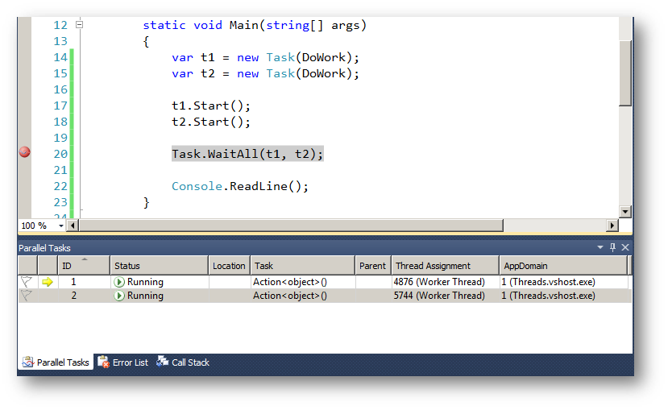
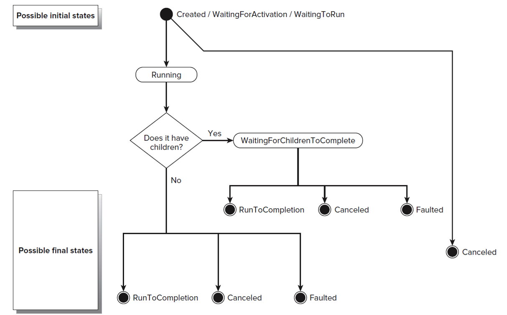

- title : Multithreading
- description : Multithreading in C# using Tasks
- author : intrueder
- theme : league
- transition : default

***
## C# course
# Multithreading

***
## Agenda

- TPL
- Task-based async pattern
- Cancellation and continuations
- async/await
- Synchronization context and task scheduling
- Exception handling
- Concurrent collections

***

##Task Parallel Library

- Introduced in .net 4.0
- Aimed to leverage multi-core processors
- Better abstractions to design concurrent applications.
- Designed to handle concurrency challenges better
    - Synchronization - locking, dead locks, race condition
    - Debugging
    - Code Complexity

***

##Task Parallel Library

- Provide data structures aimed for concurrency
    - ConcurrentQueue< T >, ConcurrentDictionary< T >, ConcurrentBag< T >
- Data-parallelism capabilities
    - AsParallel, PLINQ...
    - Partition the data
- Task parallelism capabilities

***

##Task Parallelism

- Break program into multiple operations
- Run operations in parallel
- Combine operations with continuation
- Schedule and keep track on ongoing operations

***

##Tasks

- Task< T > -  represents a T that is being computed asynchronously and will be available in the future, if it isn't already

- Task - same with task, but without return value, a bit like Task< void >

---

##How to create a task?

- Using Task.Run (or Task.Factory.StartNew)
    - Task.Run( ()= > DoWork() )
    - Run code on TaskScheduler
- Task.FromResult(), Task.FromException()
- From other tasks
- From promises (TaskCompletionSource)

---

##How to consume?

- Wait(), Result - blocking , should be avoided in most cases

```cs
Task t = Task.Run(() => DoWork())
Process(t.Result);
```

- ContinueWith() - continuation, allow us to schedule a new task, that get the original resolved task as an argument

```cs
Task t = Task.Run( () => DoWork());
t.ContinueWith(arg => Process(arg.Result))); 
```

---

##How to consume?

- Task not only wrap the result, but also wrap the exception if one has occurred

```cs
Task someTask = Task.Run(() => doSomethingDangerous());
someTask.ContinueWith((t) => {
    if (t.IsFaulted)
        Log(t.Exception)
    else
        Launch(t.Result)
});
```

- Could also be written as:

```cs
someTask.ContinueWith(t => Log(t.Exception),
                 TaskContinuationOptions.OnlyOnFaulted)
someTask.ContinueWith(t => Launch(t.Result),
                 TaskContinuationOptions.OnlyOnRanToCompletion);
```

- Task can only resolve once, it has final state

***

## Task Lifecycle



---

## Task Lifecycle



***

##Task Continuation

```cs
var t1 = Task.Run(() = > GetSomeData());
var t2 = t1.ContinueWith((t) => ProcessSomeData(t.Result));
var t3 = t2.ContinueWith((t) => SendProcessedData(t.Result));
```

- Every continuation wraps a Function delegate and return a new Task with the result of the function

***

##Run Tasks in Parallel

```cs
Task<int> t1 = Task.Run( () => ComputeOneThing() );
Task<int> t2 = Task.Run( () => ComputeOtherThing() );

Task<int[]> allTasks = Task.WhenAll(t1, t2);
```

***

##Task Cancellation

- We can pass a cancellation token to abort operation. Tokens can propagate along the continuation chain (for example downloading a large file)

- CancellationTokenSource
    - Cancel()
    - Token
- CancellationToken
    - ThrowIfCancellationRequested()
    - IsCancellationRequested
    - Register(Action callback)

***

##Task-based Asynchronous Pattern

- Introduced in .net 4.5, based entirely on Tasks
- IO classes/clients have methods with Async/TaskAsync suffix
- All those method return Task< T >
- For example : WebClientDownloadStringTaskAsync(url)

---

##Task-based Asynchronous Pattern

- Benefits
	- Tasks have final state, so you can attach continuation in any time
	- They wrap the result of the operation, making them passable as objects
	- Tasks are composable, we can join tasks together, and create another tasks
	- Tasks wrap exceptions, and are easier to debug
	- Tasks support cancellation

***

##Futures And Promises

- http://en.wikipedia.org/wiki/Futures_and_promises
- TaskCompletionSource - allow us to create an object, that can resolve an underlying task

```cs
public class TaskCompletionSource<TResult>
{
    void SetResult (TResult result);
    void SetException (Exception exception);
    void SetCanceled();

    bool TrySetResult (TResult result);
    bool TrySetException (Exception exception);
    bool TrySetCanceled();
    ...

```

---

##TaskCompletionSource

```cs
Task<string> GetText()
{
    var tcs = new TaskCompletionSource<string>();
    var dlg = new Form();
    var textBox = new TextBox();
    textBox.Parent = dlg;
    dlg.Closed += delegate
              { tcs.SetResult(textBox.Text); };
    dlg.Show();
    return tcs.Task;
}
```

---

##TaskCompletionSource

```cs
Task<IPHostEntry> GetHostEntryAsync(string hostNameOrAddress)
{
    var tcs = new TaskCompletionSource<IPHostEntry>();
    Dns.BeginGetHostEntry(hostNameOrAddress, asyncResult => {
        try {
           IPHostEntry result = Dns.EndGetHostEntry(asyncResult);
           tcs.SetResult(result);
        }
        catch (Exception e) {
           tcs.SetException(e);
        }
    }, null);
    return tcs.Task;
}
```

---

##Task.Factory.FromAsync

```cs
Task t = Task<IPHostEntry>.Factory.FromAsync<string>(
                             Dns.BeginGetHostEntry,
                             Dns.EndGetHostEntry,
                             hostNameOrAddress,
                             null);

```

***

##Continuations Can Be A Pain

- Writing in a synchronous manner is still simpler 
- Even with continuation and named methods, async code can be still ugly, and less readable

```cs
 ReadString()
.ContinueWith((t)= > ConnectToDb(t.Result)).Unwrap()
.ContinueWith((t)= > RetrieveData(t.Result)).Unwrap()
.ContinueWith((t)= > HandleResponse(t.Result))
```

- Exception handling is less intuitive, and can be confusing.
- But since .net 4.5, we have a better option: `async`/`await`!

---

##Some Example

```cs
  public Task<int> CountSomething()
  {
    Task<string> conStringTask = ReadConnectionStringAsync();
	
    Task<IDbProvider> dbTask = conStringTask
	    .ContinueWith(t => ConnectToDbAsync(t.Result),
			          TaskContinuationOption.OnlyOnRanToCompletion)
		.Unwrap();

    Task<int> queryTask = dbTask
        .ContinueWith(t =>
            t.Result
			 .QueryAsync("count * from something",
			             TaskContinuationOption.OnlyOnRanToCompletion))
		.Unwrap();

    return queryTask;
  }
```

---

##C# asycn/await

- Implement continuation in a synchronized fashion using code generation.
- Simple with magic keywords, async and await.
- Same Example:

```cs
public async Task<int> CountSomething()
{
   try
   {
        string conString = await ReadConnectionStringAsync();
        IDbProvider db = await ConnectToDbAsync(conString);
   }
   catch (Exception e)
   {
      // handle exception
   }
   
   int someCalc = await db.QueryAsync("count * from something");
   return someCalc;
}
```

***

##What Does async Mean?

- Putting async declaration on a method or a lambda means that: 
    - That we can use await in that method body
    - That we are going to return a Task (async void is exception)
    - The task object that wraps the result is auto generated by the compiler

***

##What Does await Mean?

- We can use await only:
    - In async methods and lambdas
    - Only on Task object (object with GetAwaiter())
    - When we awaiting Task, we can extract the result of the completed task.

```cs
Settings userSettings = await GetUserSettingsFromDb(userId)
```

***

##SynchronizationContext

- void Send(SendOrPostCallback d, Object state)
- void Post(SendOrPostCallback d, Object state)
- static SynchronizationContext Current { get; }

```cs
SynchronizationContext uiContext = SynchronizationContext.Current;
. . .
uiContext.Post(UpdateUI, null);
```

***

##Task Scheduler

```cs
// UI thread
var uiScheduler = TaskScheduler.FromCurrentSynchronizationContext()

var t1 = Task.Run(() => DoWork());
var t2 = t1.ContinueWith(t => UpdateUI(t.Result), uiScheduler);
```

***

##Exception Handling

- AggregateException
    - waiting with Wait
    - in ContinueWith
    - reading Result property

- TaskScheduler.UnobservedTaskException
    - GC https://dotnetfiddle.net/Ekv07V

***

##Links

- Parallel Computing http://msdn.com/concurrency
- Joseph Albahari. Threading in C# http://www.albahari.com/threading
- Samples for Parallel Programming https://code.msdn.microsoft.com/ParExtSamples
