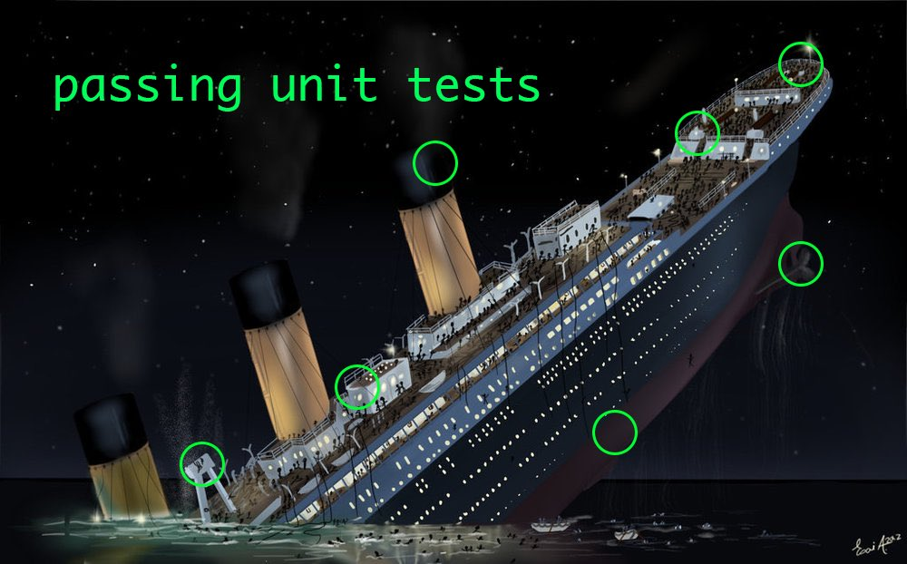

- title : Automated software testing
- description : Automated software testing
- author : intrueder
- theme : league
- transition : default

***
## C# course
# Automated software testing

***
## Agenda

- What is unit testing
- Kind of tests
- Unit testing in .Net

***

##SDLC

***

##Purpose of Testing

Testing accomplishes a variety of things, but most importantly it measures the quality of the software you are developing

***

##Why write tests?

- QA automation
- Regression prevention
- Iterative development
- Continous deployment
- Cornerstone of Agile
- TDD / BDD

Early detection of defects is less costly and easier to fix

***

##TDD? BDD?

TDD = Test Driven Development

BDD = Behavior Driven Development

---

###TDD

- Developer centric
- Source code oritented
- Organized around modules, classes, and methods

---

###BDD

- User Centric
- Use case oriented
- Organized around use cases, features, and specifications

***

##Types of software tests

Developer Centric

- Unit Test
- Integration Test
- Mutation Test

User Centric

- Functional Test
- Acceptance Test

***

##Unit test

"The primary goal of unit testing is to take the smallest piece of testable software in the application, isolate it from the remainder of the code, and determine whether it behaves exactly as you expect."

[Microsoft, Unit Testing](https://msdn.microsoft.com/en-us/library/aa292197.aspx)

---

##Unit test

"A test that verifies the behavior of some small part of the overall system. What makes a test a unit test is that the system under test (SUT) is a very small subset of the overall system"

[xUnit Patterns](http://xunitpatterns.com/unit%20test.html)

---

##Unit test

- Performed by the developer, prior to delivering code to testers.
 
- A unit test can be created one time and run every time that source code is changed to make sure that no bugs are introduced.

***

##Unit test

- Developer centric
- Grouped by classes and methods
- Serves as documentation
- Ensures component correctness

***

##Ideal unit test

- WHO
   - The developer

- WHEN
   - During development

- WHAT
   - Isolated functionality
   - Single responsibility
   - Independent
   - Publicly available functionality (API)

***

##Integration testing

Identifies problems that occur when units are combined

---

##Integration test

- Developer centric
- Complements Unit Test
- Tests interface correctness
- Typically slower than Unit Test

***

##Mutation testing

If test is correct, it should fail when the behavior of the tested code is _mutated_

---

##Mutation test

- Developer centric
- Discovers untested edge cases
- Catch bugs before code is shipped
- Enforces effective tests
- Usually very few bugs if used well
- Speed = # of Unit Test x # of mutations

***

##Functional testing

Black box testing based on feature specifications

---

##Functional test

- User centric
- Grouped by features
- Ensures feature compliance to specification
- Does not ensure side effects to other features
- Implicitly tests component interactions
- Typically much slower than Unit Test

***

##Acceptance testing

End to end tests emulating end users with use cases

---

##Acceptance test

- User centric
- Ensures side effects between features
- Limited test coverage for edge cases
- Typically the slowest among all tests
- Implicitly tests component interactions
- Sometimes performed as manual tests

---

##Other terminology

- Test coverage
- System under test (SUT)
- Fake
- Stub
- Mock

***

##How to do in .NET ?

- NUnit, xUnit, MSTest
- Moq, NSubstitute, Rhino Mocks

[more](https://github.com/dariusz-wozniak/List-of-Testing-Tools-and-Frameworks-for-.NET)

***

##

***